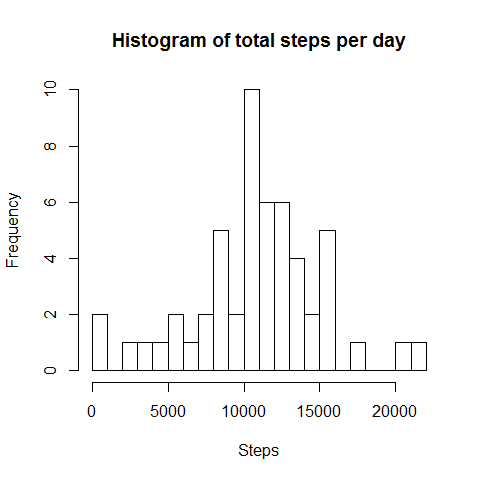
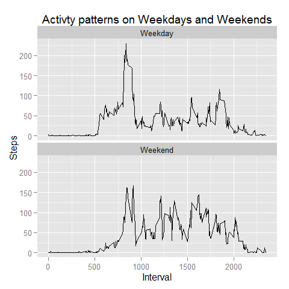

# Reproducible Research: Peer Assessment 1

## Loading and preprocessing the data
Data file needs to be unzipped and then the csv read in. 

```r
unzip(zipfile="activity.zip")
data <- read.csv("activity.csv")
str(data)
```

```
## 'data.frame':	17568 obs. of  3 variables:
##  $ steps   : int  NA NA NA NA NA NA NA NA NA NA ...
##  $ date    : Factor w/ 61 levels "2012-10-01","2012-10-02",..: 1 1 1 1 1 1 1 1 1 1 ...
##  $ interval: int  0 5 10 15 20 25 30 35 40 45 ...
```
Notice that the date column is currently a factor variable. Lets transform to a
date variable.

```r
data$date <- as.Date(data$date)
```

## What is mean total number of steps taken per day?
Load in dplyr package to assist in analysis of data. First the data will be 
split up by date and then summed.

```r
library("dplyr")
```

```
## 
## Attaching package: 'dplyr'
## 
## The following object is masked from 'package:stats':
## 
##     filter
## 
## The following objects are masked from 'package:base':
## 
##     intersect, setdiff, setequal, union
```

```r
databydate <- group_by(data, date)
stepsperday <- summarise(databydate, sum(steps))
```
Now we know the number of steps taken in each day we can produce a histogram of 
this.

```r
hist(stepsperday$sum, main="Histogram of total steps per day", xlab="Steps",
     ylab="Frequency", breaks=25)
```

 

This shows us that just over ten thousand is the most common number of steps  
per day. We can also look at the mean and median total steps per day.

```r
meansteps <- as.integer(mean(stepsperday$sum, na.rm=T))
mediansteps <- median(stepsperday$sum, na.rm=T)
```
Mean steps per day:     10766  
Median steps per day:   10765
   
## What is the average daily activity pattern?
We are now interested in the daily activity pattern. IE the average number of  
steps in each interval across all the days. So lets group the data by interval,  
and then take the average. This will then be drawn into a graph.

```r
databyint <- group_by(data,interval)
averagebyint <- summarise(databyint,mean(steps, na.rm=T))
plot(averagebyint, type="l", main = "Daily activity pattern", xlab="Interval",  
     ylab="Average steps")
```

 

Peak looks to be somewhere around the 8:00 mark. Lets calculate it.

```r
maxintind <- which.max(averagebyint$mean)
maxint <- averagebyint[maxintind,1]
```
Average maximum steps interval is: 835

## Imputing missing values
The data has an number of missing values. Lets work out how many, and how large  
a percentage of the data this is.

```r
numna <- sum(!complete.cases(data))
pcna <- round((numna/nrow(data))*100 )
```
We can see there are 2304 missing values. This equates to about 13%  
of the data set.

So lets devise a strategy for filling those in. The simplest way to do this  
would be to insert the average value for steps in the interval  into any  
interval that is missing a value. Lets check that there isn't any pattern to the  
missing data that would add a skew by filling in with the missing values.

```r
nanobyint <- summarise(databyint,sum(is.na(steps)))
totbyint <- summarise(databyint,sum(!is.na(steps)))
nabyday <- summarise(databydate,sum(is.na(steps)))
nabyday$weekday <- weekdays(nabyday$date)
names(nabyday) <- c("date","missing","weekday")
```
By looking at the above vectors we can see that there are 8 days missing.

```r
nabyday[nabyday$missing != 0,]
```

```
## Source: local data frame [8 x 3]
## 
##         date missing   weekday
## 1 2012-10-01     288    Monday
## 2 2012-10-08     288    Monday
## 3 2012-11-01     288  Thursday
## 4 2012-11-04     288    Sunday
## 5 2012-11-09     288    Friday
## 6 2012-11-10     288  Saturday
## 7 2012-11-14     288 Wednesday
## 8 2012-11-30     288    Friday
```
No obvious pattern so we are okay to proceed with filling in the NA vales.

```r
datacomp <- data # copy data
# loop through every row of the data
for (i in 1:nrow(datacomp)) {
    #where we find a missing value
    if (is.na(datacomp[i, 1])) {
        # insert value
        datacomp[i,1] <- round(averagebyint[averagebyint$interval==
                                                datacomp[i,3],2][[1,1]])      
    }
}
```
Now lets repeat our previous calculations on the totals steps per day and, the   
mean and median steps of this complete data set.

```r
compdatabydate <- group_by(datacomp, date)
compstepsperday <- summarise(compdatabydate, sum(steps))
```
Now we know the number of steps taken in each day we can produce a histogram of   
this. The complete data in red has been overlayed with the original data in blue.

```r
hist(compstepsperday$sum, main="Histogram of total steps per day", xlab="Steps",  
     ylab="Frequency", breaks=25,col=rgb(1,0,0,0.5))
hist(stepsperday$sum, breaks=25, col=rgb(0,0,1,0.5), add=T)
```

 

This shows us that the general distribution has not changed with filling in the  
data, however we have increased the frequency of the peak number of steps. This  
is to be expected as we have added 8 average days to the data. Now lets see what  
effect we had on mean and median.

```r
compmeansteps <- as.integer(mean(compstepsperday$sum, na.rm=T))
compmediansteps <- median(compstepsperday$sum, na.rm=T)
```
Mean steps per day complete data:     10766  
Median steps per day complete data:   10765  
No change here.

## Are there differences in activity patterns between weekdays and weekends?
Lets add some columns to the data set so we can tell the whether its a weekend or  
a weekday.

```r
datacomp$day <- weekdays(datacomp$date)
datacomp$weekzone <- 0
# loop through every row of the data
for (i in 1:nrow(datacomp)) {
    #where we find a missing value
    if (datacomp[i,4] %in% c("Saturday","Sunday")) {
        # insert value
        datacomp[i,5] <- "Weekend"      
    }
    else
        datacomp[i,5] <- "Weekday"
}
datacomp$weekzone <- as.factor(datacomp$weekzone)
```
Now lets group the data by week zone and interval

```r
datacompgroup <- group_by(datacomp,weekzone,interval)
meanperdaygroup <- summarise(datacompgroup, mean(steps))
names(meanperdaygroup) <- c("weekzone","Interval","Steps")
```
And now we can produce a graph to show the comparison

```r
library("ggplot2")
```

```
## Warning: package 'ggplot2' was built under R version 3.1.3
```

```r
ggplot(meanperdaygroup, aes(Interval, Steps)) + geom_line() + 
    facet_wrap(~weekzone, ncol = 1) + 
    labs(title = "Activty patterns on Weekdays and Weekends")
```

 

The graph shows that on average the subject has more steps at the weekend. The     
exception to this is the large peak at 8:30 on weekdays. This might be the time   
when the subject walks to work, where, in general he is not moving around much.  
The subject appears to get up much earlier on weekdays also.

